# ⚽ Capital Play

<div align="center">

# 🏟️ Capital Play
### Smart Sports Ground Booking Platform

A modern full-stack SaaS platform that digitalizes sports ground booking through real-time slot management, intelligent scheduling, live messaging, and automated booking workflows.

[]()
[]()
[]()
[]()
[]()
[]()

### 🚀 Live Demo
**Frontend:** https://capital--play.vercel.app

</div>

---

# 📖 Overview

Capital Play is a comprehensive sports ground booking ecosystem developed to eliminate manual booking procedures and provide a centralized platform for players, ground owners, and administrators.

The platform enables users to discover sports venues, reserve available slots, communicate in real-time, manage bookings, and receive live updates through a scalable cloud-hosted architecture.

---

# 🎯 Problem Statement

Traditional sports ground booking systems often suffer from:

- Manual reservation management
- Double booking conflicts
- Lack of real-time availability updates
- Poor communication between players and owners
- Limited administrative oversight
- Inefficient booking workflows

Capital Play addresses these challenges through automation, real-time synchronization, and intelligent backend services.

---

# ✨ Key Features

## 👤 User Management

- Secure Registration & Login
- JWT Authentication
- Role-Based Access Control
- Profile Management
- User Approval System

---

## 🏟️ Ground Management

- Ground Listing & Discovery
- Ground Approval Workflow
- Ground Image Galleries
- Availability Tracking
- Owner Dashboard

---

## 📅 Smart Booking System

- Real-Time Slot Availability
- Dynamic Slot Generation
- Booking Validation
- Conflict Prevention
- Automated Booking Lifecycle

---

## 💬 Real-Time Messaging

- Instant User Communication
- WebSocket-Based Chat
- Persistent Message Storage
- Conversation Management
- Real-Time Delivery

---

## 👻 Ghost Engine

One of the project's core innovations.

### Responsibilities

- Automatic Slot Generation
- Expired Booking Detection
- Slot Release Automation
- Availability Synchronization
- Background Booking Monitoring

The Ghost Engine continuously ensures system consistency without requiring manual intervention.

---

## 🛡️ Administrative System

- User Moderation
- Ground Approval/Rejection
- Booking Oversight
- Reports Management
- Warning & Ban Mechanisms
- Audit Logging

---

# 🏗️ System Architecture

## High-Level Architecture

```text
Players / Owners / Admins
            │
            ▼
 ┌─────────────────────┐
 │ React Frontend      │
 │ (Vercel)            │
 └─────────────────────┘
            │
            ▼
 ┌─────────────────────┐
 │ Node.js + Express   │
 │ Backend (Render)    │
 └─────────────────────┘
       │         │
       ▼         ▼
 MySQL DB    Socket.io
 (Railway)   Realtime
       │
       ▼
 Cloudinary
 Media Storage
```

---

# 🖼️ Architecture Diagrams

## System Architecture

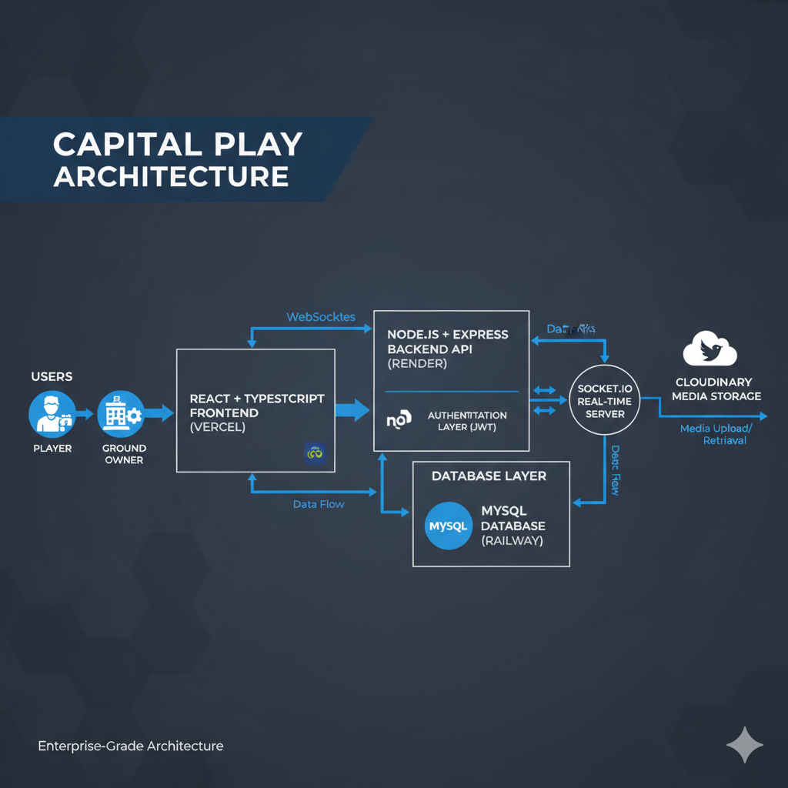

---

## Ghost Engine Architecture

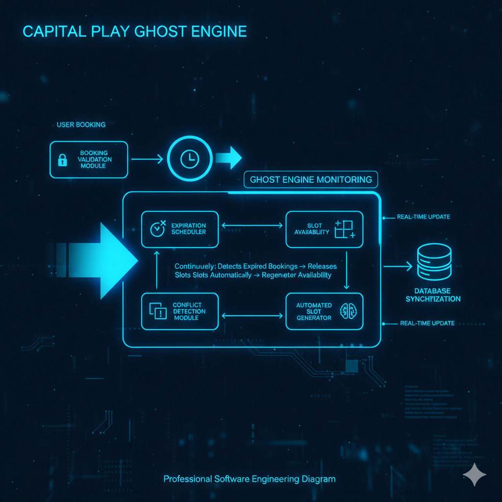

---

## Real-Time Messaging Architecture

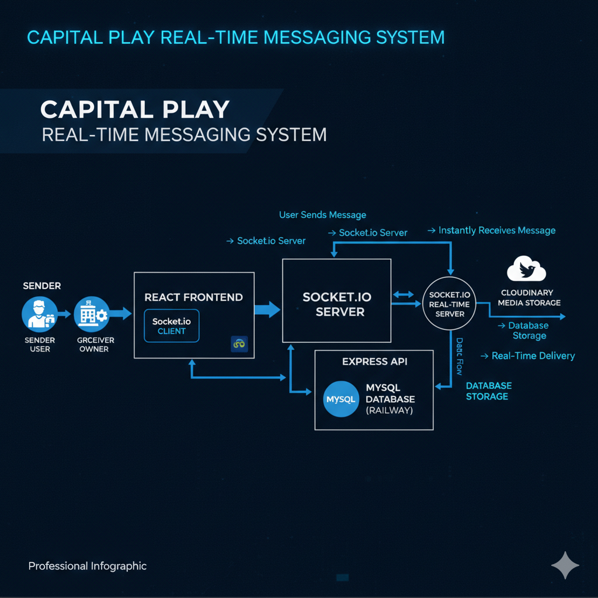

---

## Database Architecture

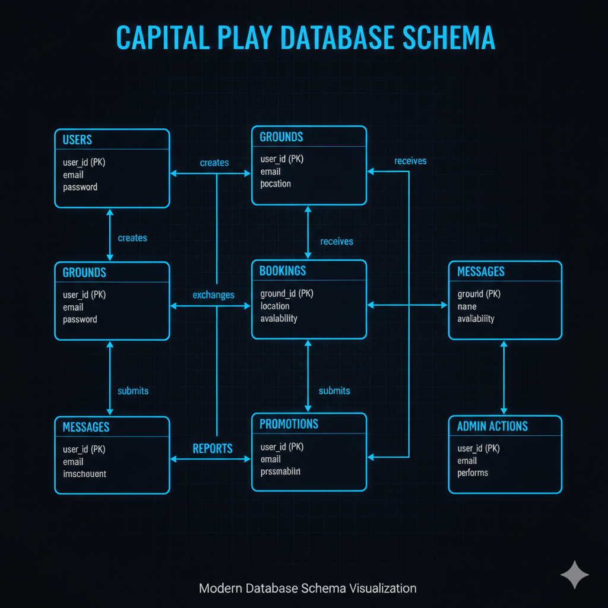

---

## Deployment Architecture

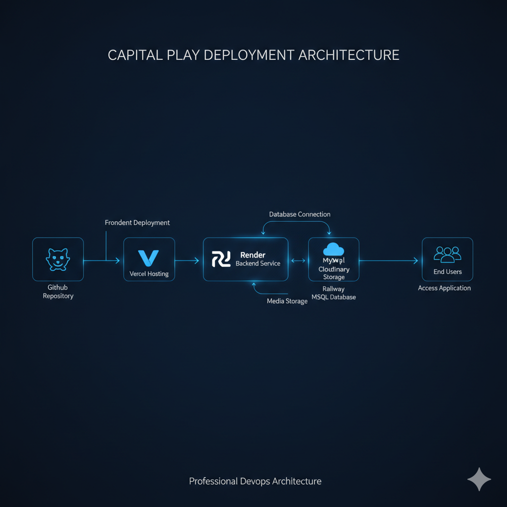

---

## Business Logic Flow

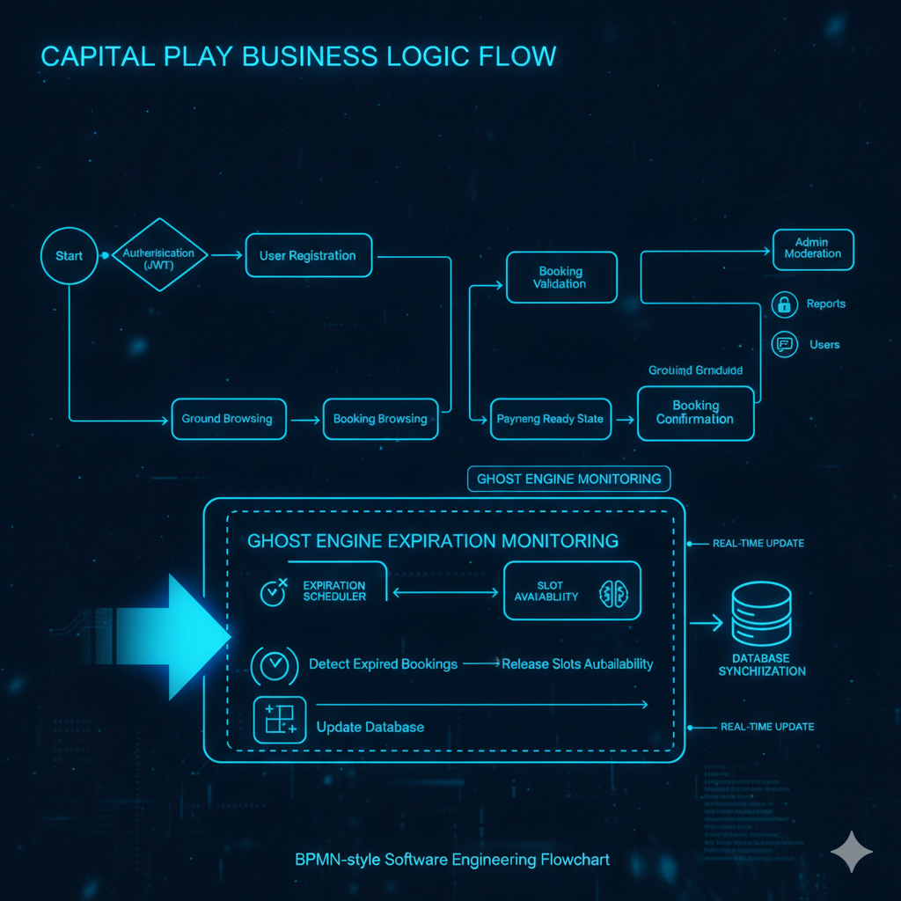

---

# ⚙️ Technology Stack

## Frontend

- React
- TypeScript
- Vite
- Tailwind CSS
- Axios
- React Router
- Socket.io Client

---

## Backend

- Node.js
- Express.js
- Sequelize ORM
- JWT Authentication
- Socket.io
- Cron/Scheduler Services

---

## Database

- MySQL
- Railway Cloud Database

---

## Cloud & DevOps

- Vercel
- Render
- Railway
- Cloudinary
- GitHub

---

# 💬 Real-Time Communication

Capital Play uses Socket.io to provide:

- Instant Messaging
- Live Booking Updates
- Event Broadcasting
- Real-Time Notifications

### Workflow

```text
User Sends Message
        │
        ▼
Socket.io Server
        │
        ▼
Store in MySQL
        │
        ▼
Receiver Gets Message Instantly
```

---

# 🧠 Business Logic Highlights

## Booking Validation

The system prevents:

- Double Bookings
- Invalid Time Slots
- Unauthorized Reservations

---

## Slot Management

The platform automatically:

- Generates Slots
- Updates Availability
- Handles Expirations

---

## Moderation Layer

Administrators can:

- Approve Grounds
- Ban Users
- Review Reports
- Monitor Activity

---

# 🗄️ Database Design

Core entities include:

| Entity | Purpose |
|----------|----------|
| Users | User Management |
| Grounds | Sports Venues |
| Bookings | Reservation Records |
| Messages | Chat System |
| Promotions | Marketing Campaigns |
| Reports | Moderation Reports |
| Admin Actions | Administrative Audit Logs |

---

# 🔐 Security Features

- JWT Authentication
- Access Tokens
- Refresh Tokens
- Protected Routes
- Role-Based Authorization
- Environment Variable Protection

---

# 📸 Screenshots

## Home Page

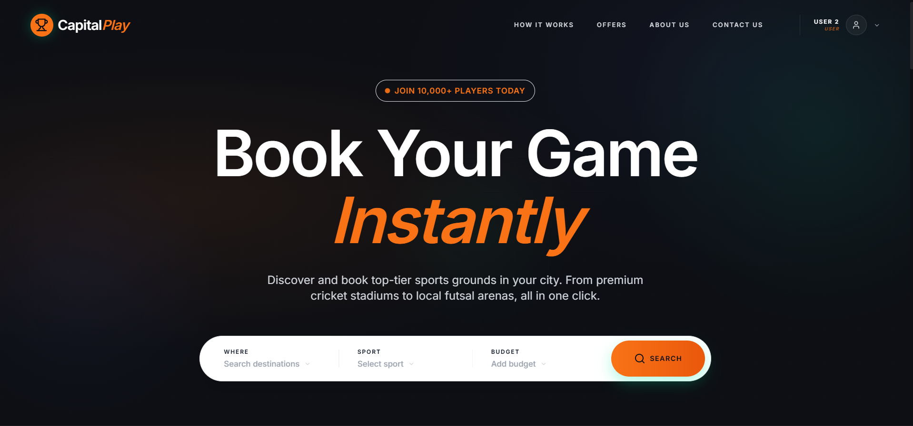

---

## Ground Listings

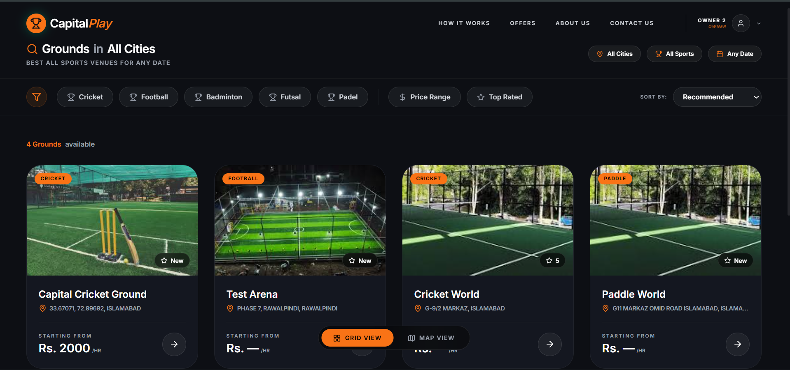

---

## User Dashboard

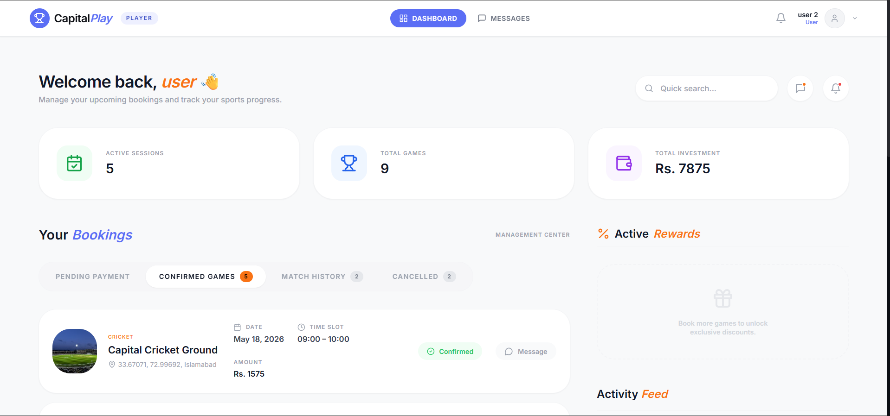

---

## Real-Time Chat

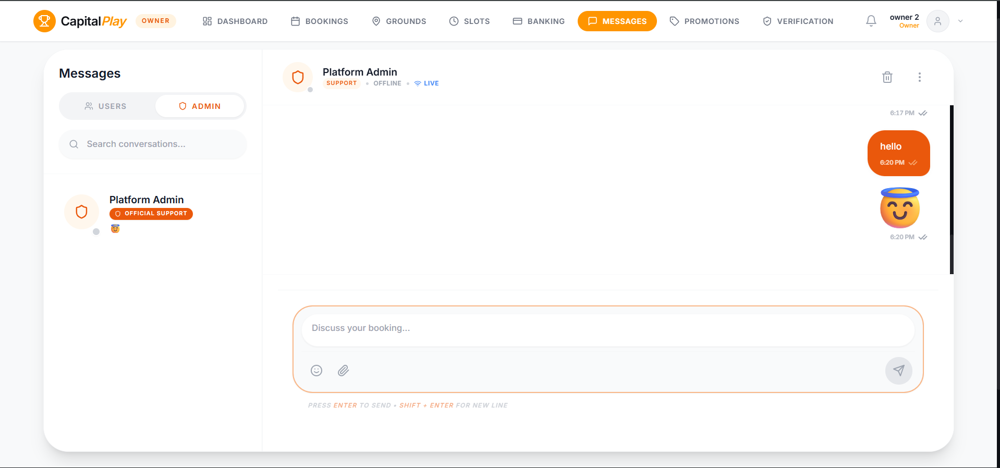

---

## Admin Dashboard

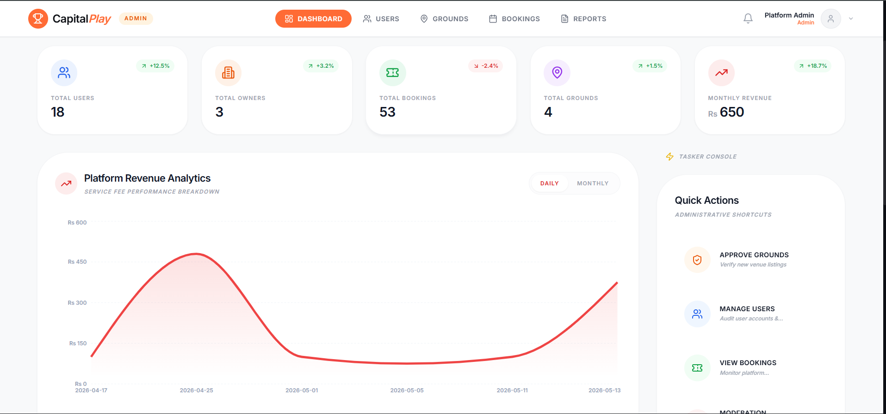

---

# 🚀 Deployment

## Frontend

Hosted on:

**Vercel**

```text
React + Vite
```

---

## Backend

Hosted on:

**Render**

```text
Node.js + Express
```

---

## Database

Hosted on:

**Railway**

```text
MySQL
```

---

# 📈 Project Achievements

✅ Full Stack SaaS Application

✅ Real-Time Communication System

✅ Cloud Deployment

✅ Automated Booking Management

✅ Intelligent Scheduling Engine

✅ Enterprise-Style Architecture

✅ Production Database Hosting

✅ Authentication & Authorization

---

# 🔮 Future Enhancements

- Online Payment Integration
- Mobile Application
- AI-Based Demand Prediction
- Push Notifications
- Advanced Analytics Dashboard
- Recommendation System

---

# 👨‍💻 Development Team

### Capital Play Development Team

- Abdul Sammad
- Team Members

---

# 📚 Academic Context

This project was developed as part of a Software Engineering course to demonstrate:

- Software Architecture Design
- Full Stack Development
- Database Engineering
- Real-Time Systems
- Cloud Deployment
- Software Project Management

---

# 📄 Repository Information

> The complete source code repository is maintained privately.
>
> This repository serves as a public showcase containing documentation, architecture diagrams, screenshots, and deployment information.

---

# 🌐 Live Demo

### Frontend

```text
https://capital--play.vercel.app
```

### Backend

```text
Private
```

---

<div align="center">

### ⭐ If you found this project interesting, consider giving the repository a star.

**Capital Play — Smart Sports Ground Booking Platform**

</div>
